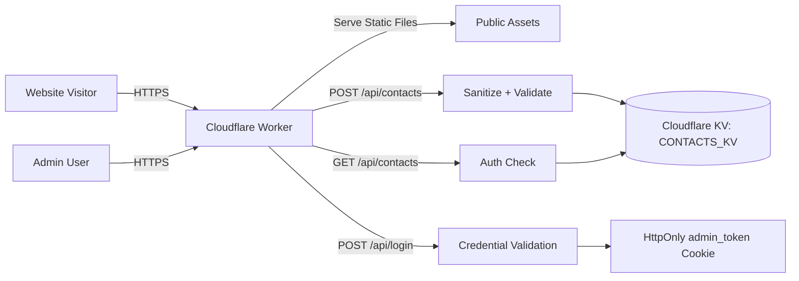

# Architecture

## Purpose

This document describes the production architecture of the Slimes.Hustlers AI Solutions website and lead intake platform deployed on Cloudflare Workers.

## High-Level Design

## Core Components

- Cloudflare Worker entrypoint: Handles request routing and API execution.
- Static asset layer: Serves public frontend files from `public/` through Cloudflare assets.
- API handlers: Business logic under `src/` for contacts, auth, logout, and sanitization.
- Data layer: Cloudflare KV namespace bound as `CONTACTS_KV`.

## Request Routing

- Requests to `/api/*` are processed by Worker route handlers.
- Non-API requests are served from static assets using `env.ASSETS.fetch`.
- All responses are passed through a global security-header layer before returning to clients.

## Runtime and Platform

| Layer | Technologies |
| --- | --- |
| Runtime | Cloudflare Workers (JavaScript, `nodejs_compat`) |
| Frontend | HTML5, CSS3, Vanilla JavaScript |
| Backend/API | JavaScript module handlers in `src/` |
| Storage | Cloudflare KV (`CONTACTS_KV`) |
| Testing | Playwright and Node-based tests |
| Deployment | Wrangler and GitHub Actions |

## Authentication and Access Model

- Admin authentication is performed through `POST /api/login`.
- Successful authentication sets an `HttpOnly` cookie for admin access.
- Contact retrieval endpoint (`GET /api/contacts`) requires valid admin credentials via bearer token or cookie.

## Data Flow Summary

1. Public users submit lead forms through the website.
2. Worker validates and sanitizes inbound payloads.
3. Valid contact entries are persisted in Cloudflare KV.
4. Admin users authenticate and retrieve stored leads through protected API routes.

## Operational Notes

- Architecture is optimized for low-ops serverless deployment.
- Security-sensitive settings are managed via Wrangler secrets and CI repository secrets.
- The repository follows documentation-first governance for production maintainability.
